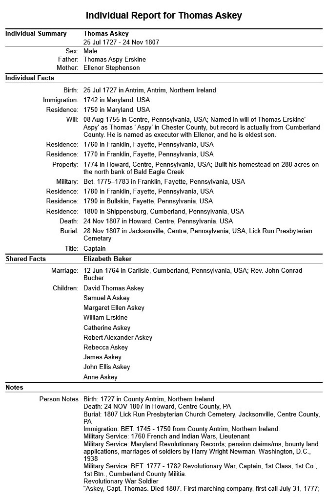

 Genealogy Pipeline — Project Notes

**Project:** Census Data → GEDCOM Family Tree  
**Repository:** https://github.com/AJAskey/Genealogy  
**Last Updated:** May 2026

---

## Project Goal

Convert USA census data (1850–1950) into a validated GEDCOM file
suitable for genealogy for sharing with family. The pipeline must
handle ~281 million records across 10 census years, resolve unnamed
individuals using scoring logic, and produce a family tree with proper
source citations.

My personal objective is to find all relatives of Captain Thomas Erskine/Askey (1727-1806) from 1850-1950 census data.
There are many family trees created and the goal is to find the best existing tree. I have been working on this for 
over 20 years by hand and longed for the day computers could help. That day is here. 
 This software can be cloned and used by others in similar family situations.


---

## Current State (as of late May 2026)

- Raw CSV files downloaded from IPUMS: 1850–1950, one file per census year
- Files stored locally at: `E:\Storage\Census\IPUMS\Original`
- SQLite databases created (one per decade): `D:\Data\Genealogy_Data`
- Ingest pipeline working: approximately 8 hours to process all years
- DB Browser being used for data exploration

**Known Data Issues:**
- Approximately 75% of records are missing name data (illegible handwriting  in original census documents or held back by IPUMS to force payment to the 
  commercial companies involved.)
- Records with missing names are otherwise high quality — the gap is names only
- MOMLOC and POPLOC fields in IPUMS already link parents to children withina household — 
  this is check completeness before building custom matching logic

---

## Architecture Decisions (Locked)


All four AI advisors and project lead agreed unanimously: do NOT process
matching logic during CSV ingest. Reasons:

- Cross-census matching requires looking backward and forward across decades.
  A single CSV pass only sees one row at a time.
- If matching logic crashes at hour 7 of ingest, raw data is safe in the DB.
- Matching algorithm will need multiple iterations and tuning. Separating it
  from ingest means you can rerun matching without re-ingesting raw data.
- Separation of concerns: Raw DB = ground truth. Clean DB = interpreted output.

### Decision 2: Two-Tier Database Architecture

| Database | Purpose |
| --- | --- |
| Raw DB | Exact IPUMS import, never modified |
| Clean DB | Resolved identities, Origin IDs, citations |

The Raw DB is the vault. The Clean DB is the output. They never mix.

### Decision 3: Human Review Gate (Text File Buffer)

Matching candidates will be written to human-readable TEXT FILES before anything is written to the Clean DB. 
Andy reviews and edits these files, then a second script reads the approved files and writes to the Clean DB.

This eliminates all concurrency and write-contention concerns. It also provides a permanent audit trail of every matching decision made.

Text file format (proposed):

```
MATCH CANDIDATE - Score: 8/13
  1880: SERIAL 12345 | John [BLANK] | Age 45 | VA | 3 children
  1890: SERIAL 67890 | John SMITH  | Age 54 | VA | 2 children
  ACTION: [APPROVE / REJECT / MAYBE]
  NOTES:
```

### Decision 4: Permanent Person ID (Origin ID / "St. Joe's ID")

Every individual gets a unique integer ID that never changes, never gets reused, and encodes no data about the person. This is assigned once, at
the moment a match is approved.

- Use a simple sequential integer starting at 1
- Stored in as part of the Origin ID below.

**Critical:** Origin ID must be at the PERSON level (YEAR + SERIAL + PERNUM + ID integer),
not the household level. Households split and merge across decades.
The incremental ID points to the line in the CSV file if one ever needs to go back and reference where the data came from. 

### Decision 5: Citation Tracking

Every record in the Clean DB must have a citation row linking it to its source. This is both good genealogy practice 
and provides protection if IPUMS data use questions arise later.

Citation table structure:
```
PersonID  | Source   | SourceDetail                   | CensusYear | SERIAL | PERNUM
100042    | IPUMS    | census-1880.csv, row 4,521,307  | 1880       | 12345  | 3
100042    | Ancestry | Death Certificate, Cook Co. IL  | 1923       | --     | --
```

If IPUMS data use agreement becomes a concern, citations can be switched to reference the primary source 
(US Federal Census, National Archives) instead of IPUMS directly. The family tree structure is unaffected either way.

---

## Pipeline Design (Two Scripts)

### Script 1 — The Analyst

- Reads Raw DB
- Runs scoring/matching logic
- Writes candidate match files as human-readable text
- Makes NO writes to any database
- Can be run repeatedly, tweaked, rerun — zero risk

### Script 2 — The Writer

- Reads approved text files (after Andy reviews them)
- Assigns Person IDs
- Writes to Clean DB
- Writes to Citation table
- Simple, linear, no concurrency needed

---

## Matching Algorithm (Scoring Logic)

### Scoring Components (agreed across all AI advisors)

| Component | Points | Notes |
| --- | --- | --- |
| Age Consistency | 0–3 | Expected age ± tolerance across 10 years |
| Household Structure | 0–5 | Household vector comparison (see below) |
| Geography | 0–3 | Same county > same state > different state |
| Name Match | 0–2 | When available: exact, phonetic (Soundex) |
| **Total** | **0–13** |  |

Thresholds:
- 10–13: Strong match — likely approve
- 7–9: Probable match — review carefully
- Below 7: Reject

**Always store the score** in the output file. Never make a hard match without a score. Some records will be genuinely unresolvable — that is OK.

### Household Vector (ChatGPT recommendation — adopt this)

Instead of just counting siblings, create a household signature:
`[FatherAge, MotherAge, ChildAges-sorted]` → `[45, 42, 18, 16, 12, 8]`

Compare vectors across decades using delta scoring. This is your strongest cross-census fingerprint because the whole family structure must match,
not just one person.

### Blocking Strategy (CoPilot recommendation — adopt this)

NEVER compare everyone to everyone. That is combinatorial explosion.  Narrow candidates first, then score:

1. Block by: State + County + Birth Year range (± 2 years)
2. Score only within those blocks
3. SQL does the blocking. Python does the scoring.

This is the difference between finishing in hours vs. weeks.

### Anchor Strategy

Do not try to match everyone equally. Anchor on fathers first (most identifiable in historical data), then cascade to children via IPUMS
POPLOC/MOMLOC pointers.

---

## Technical Notes

### Memory

Do not load entire CSV files into memory. Census-1940.csv is 18 GB.
Use chunked processing: read 50,000 rows at a time.

```python
import pandas as pd

chunk_size = 50_000
for chunk in pd.read_csv('census-1940.csv', chunksize=chunk_size):
    # process chunk, write to raw DB
    pass
```

### SQLite Indexing

Indexes are the difference between hours and days. Index these columns:

- census_year
- state, county (composite)
- serial
- birth_year_est
- sex
- surname (when present)

### IPUMS Built-In Pointers (Check These First)

Before building custom matching, audit how complete these IPUMS fields are:

- `MOMLOC` — person number of mother within household
- `POPLOC` — person number of father within household
- `SPLOC` — person number of spouse within household

### Threading / Concurrency

Processing is threaded. The number of workers is a command line parameter (1 is default).

Two options  output available - One massive DB or many smaller DBs are written. 
- One is easier to process family linkage across ten-year increments.
- Multiple databases are smaller and each one is easier to read in the browser. 
---

## GEDCOM Output Considerations

- GEDCOM requires individuals, not households
- Origin ID must be at person level (SERIAL + PERNUM combined)
- Citations attach to individuals in GEDCOM format
- Households split and merge between census years — the person ID
  is the stable anchor, not the household

---

## Open Questions

1. **IPUMS Data Use Agreement** — Question submitted to IPUMS regarding    sharing derived GEDCOM with family. Awaiting response.
  - Fallback: cite US Federal Census (National Archives) instead of IPUMS
  - The family tree structure is unaffected either way

2. **MOMLOC/POPLOC completeness** — Run audit query before building    custom matching. May significantly reduce scope of work needed.

3. **Confidence threshold tuning** — What score threshold triggers auto-approve vs. manual review? Start conservative, loosen over time.

---

## File Locations (Local Machine)

| Location | Contents |
| --- | --- |
| `E:\Storage\Census\IPUMS\Original` | Raw CSV files from IPUMS |
| `D:\Data\Genealogy_Data` | SQLite databases (one per decade) |
| `E:\Users\Andy\PycharmProjects\Genealogy\design` | Design documents, AI responses |
| `E:\Users\Andy\PycharmProjects\Genealogy\python` | Python scripts
| `E:\Users\Andy\PycharmProjects\Genealogy\JSON`   | JSON files associted with index from DB

---

## AI Advisor Notes

Responses were collected from ChatGPT, Gemini, and CoPilot in addition to ongoing work with Claude. All four agreed on Option B (post-ingest),
the two-tier architecture, and against loading full CSVs into memory.

Key unique contributions:
- **ChatGPT:** Household Vector concept (strongest fingerprint)
- **Gemini:** Emphasized MOMLOC/POPLOC built-in IPUMS linkers
- **CoPilot:** Blocking-before-scoring strategy; UUID for IDs (we chose
  sequential int instead for readability)
- **Claude:** Human review gate / text file buffer; person-level vs.
  household-level Origin ID distinction; citation tracking for IPUMS
  data use protection

