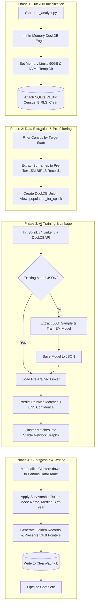

# Analyst Pipeline Flowchart

This flowchart visualizes the Phase 2 AI Entity Resolution process, handled by `run_analyst.py` and `CreateGoldenRecord.py`.

```mermaid
graph TD
    subgraph Phase 1: DuckDB Initialization
        A[Start: run_analyst.py] --> B[Init In-Memory DuckDB Engine]
        B --> C[Set Memory Limits 90GB & NVMe Temp Dir]
        C --> D[(Attach SQLite Vaults: Census, BIRLS, Clean)]
    end

    subgraph Phase 2: Data Extraction & Pre-Filtering
        D --> E[Filter Census by Target State]
        E --> F[Extract Surnames to Pre-filter 15M BIRLS Records]
        F --> G[Create DuckDB Union View: population_for_splink]
    end

    subgraph Phase 3: AI Training & Linkage
        G --> H[Init Splink v4 Linker via DuckDBAPI]
        H --> I{Existing Model JSON?}
        I -- No --> J[Extract 500k Sample & Train EM Model]
        J --> K[Save Model to JSON]
        I -- Yes --> L[Load Pre-Trained Linker]
        K --> L
        L --> M[Predict Pairwise Matches > 0.95 Confidence]
        M --> N[Cluster Matches into Stable Network Graphs]
    end

    subgraph Phase 4: Survivorship & Writing
        N --> O[Materialize Clusters down to Pandas DataFrame]
        O --> P[Apply Survivorship Rules: Mode Name, Median Birth Year]
        P --> Q[Generate Golden Records & Preserve Vault Pointers]
        Q --> R[(Write to CleanVault.db)]
        R --> S[Pipeline Complete]
    end
```